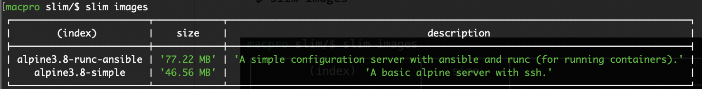
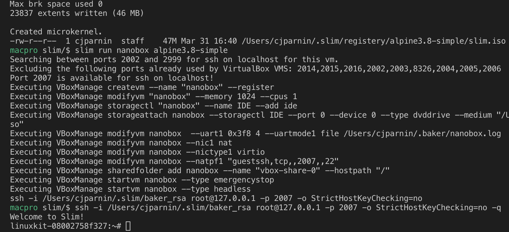

# slim

`slim` will build a micro-vm from a Dockerfile. Slim works by building and extracting a rootfs from a Dockerfile, and then merging that filesystem with a small minimal kernel that runs in RAM.

This results in a real VM that can boot instantly, while using very limited resources. If done properly, slim can allow you to design and build immutable unikernels for running services, or build tiny and embedded development environments.

## Using slim


### Build a micro-vm

Create a micro-vm from a Dockerfile. Use `build` command with a directory containing a Dockerfile.

```
$ slim build images/alpine3.8-runc-ansible
```

This will add a bootable iso in the slim registry. [See example Dockerfile](https://github.com/ottomatica/slim/tree/master/images/alpine3.8-runc-ansible).

### Listing micro-vm images

See a list of micro-vm images on your machine.

```
$ slim images
```



### Running a micro-vm

Provision a new instance of the given micro-vm image as a virtual machine.

```
$ slim run micro1 alpine3.8-runc-ansible
```



VirtualBox will run the micro-vm instance as an attached iso loaded into a cdrom, and boot up the iso in seconds.

For convenience, a ssh connection command is provided at the end of the command, allowing easy access into the machine:
Example: `ssh -i /Users/cjparnin/.slim/baker_rsa root@127.0.0.1 -p 2008 -o StrictHostKeyChecking=no`

## Installing slim

Simply clone this repo and run.

```
npm install
npm link
```

Unfortunately, due to the experimental nature, there are a few dependencies you must also install:

* [VirtualBox](https://www.virtualbox.org/wiki/Downloads)
* [docker](https://docs.docker.com/install/)
* gtar: `brew install gnu-tar`
* cdrtools: `brew install cdrtools`
