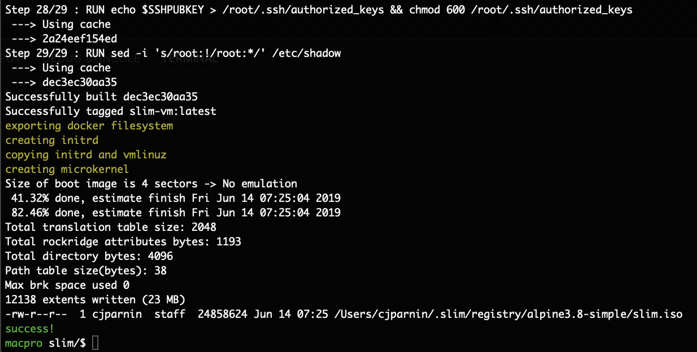
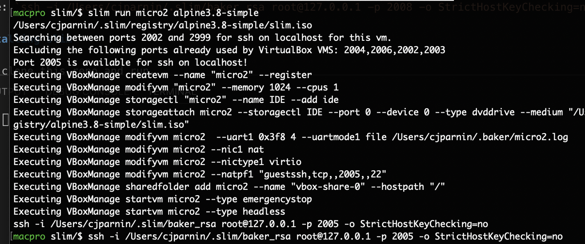

[](https://travis-ci.org/ottomatica/slim)

# slim

`slim` will build a micro-vm from a Dockerfile. Slim works by building and extracting a rootfs from a Dockerfile, and then merging that filesystem with a small minimal kernel that runs in RAM.

This results in a real VM that can boot instantly, while using very limited resources. If done properly, slim can allow you to design and build immutable unikernels for running services, or build tiny and embedded development environments.

## Using slim


### Build a micro-vm

Create a micro-vm from a Dockerfile. Use `build` command with a directory containing a Dockerfile.

```
$ slim build images/alpine3.8-simple
```



This will add a bootable iso in the slim registry. [See example Dockerfile](https://github.com/ottomatica/slim/tree/master/images/alpine3.8-simple).


### Listing micro-vm images

See a list of micro-vm images on your machine.

```
$ slim images
```


### Running a micro-vm

Provision a new instance of the given micro-vm image as a virtual machine (using virtualbox). Use `-p kvm` or `-p hyperkit` to switch providers.

Using hyperkit (available on macOS).

```
$ slim run micro1 alpine3.8-simple -p hyperkit
```


Using virtualbox (default).

```
$ slim run micro1 alpine3.8-simple
```



VirtualBox will run the micro-vm instance as an attached iso loaded into a cdrom, and boot up the iso in seconds.

For convenience, a ssh connection command is provided at the end of the command, allowing easy access into the machine:
Example: `ssh -i /Users/cjparnin/.slim/baker_rsa root@127.0.0.1 -p 2008 -o StrictHostKeyChecking=no`

## Installing slim

Simply clone this repo and run.

```
npm install
npm link
```

Unfortunately, due to the experimental nature, there are a few system dependencies you must also install:

* [docker](https://docs.docker.com/install/), for building and extracting the kernel and filesystem.
* cdrtools: `brew install cdrtools`, for building the micro-vm iso.

To boot and run the image, you also need a hypervisor:
* [VirtualBox](https://www.virtualbox.org/wiki/Downloads), `kvm` on Linux, or `hyperkit` on macOS.

For kvm, you can install the following dependencies for ubuntu:

```bash
sudo apt-get install qemu-kvm libvirt-bin virtinst bridge-utils cpu-checker mkisofs
```